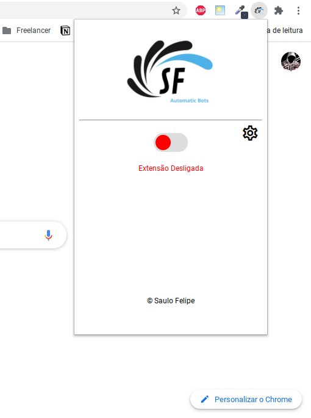
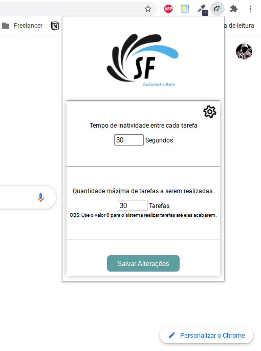
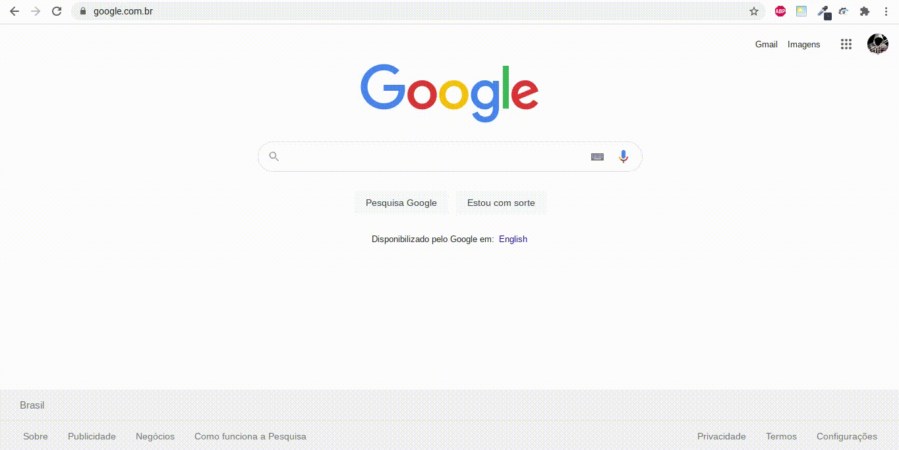
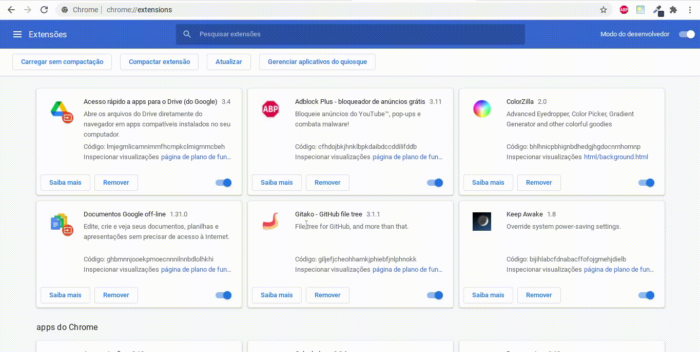

# JavaScript - Bot para automatizar ganhos no Dizu 🤖

Esta extensão utiliza Javascript + manifest V3 + referencia da API de desenvolvimento do chrome [aqui](https://developer.chrome.com/docs/extensions/mv3/getstarted/)

# Screenshots 📸

 
 

# Download:

O Download está disponível No Github Pages, segue o link:
 [Download Page](https://saulo-felipe.github.io/instagram-bot-dizu/)

# Instalação: 
#### 1. Faça o download do arquivo .crx na página citada anteriormente;
#### 2. Vá até a pagina de extensões do Chrome, e em seguida ative o modo desenvolvedor: 
;
#### 3. E, por fim, instale o arquivo que você baixou, arrastando ele para a página de extensões:

 

 

😎 Saulo Felipe
 