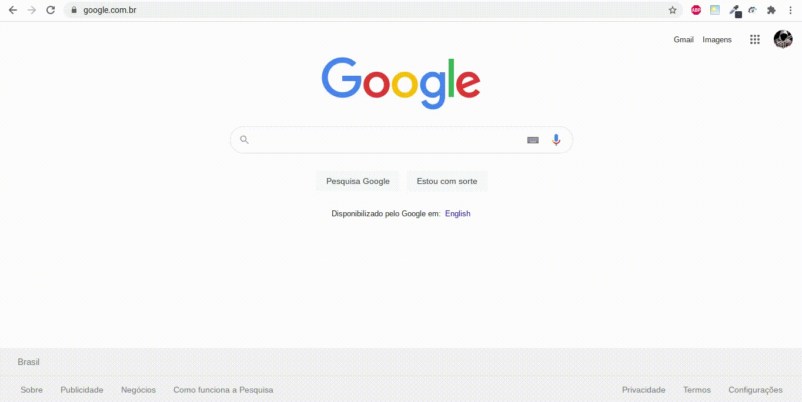

    

------------------------------------
## Índice

* [Sobre](#sobre)
* [Funcionalidades](#funcionalidades)
* [Como Executar](#como-executar)
* [Tecnologias](#tecnologias)
* [Autor](#autor)
* [Licença](#licenca)
* <a href="https://saulo-felipe.github.io/AUTOMATION-Bot-Dizu/" target="_blank">🧩 SF Automatic ---- Concluído ✅ ----</a>

------------------------------------

## 💻 Sobre 
 
 🧩 Extensão para o chrome que automatiza os ganhos na plataforma <a href="https://dizu.com.br/">dizu</a>. Esse sistema de automoção utiliza as mais recentes tecnologias do <a href="https://developer.chrome.com/docs/extensions/mv3/intro/">Google Extension</a> (manifest V3).
 

------------------------------------

## ⚙️ Funcionalidades 
1. ✅ Sistema de notificações
2. ✅ Configuração de tempo entre cada tarefa
3. ✅ Quantidade de tarefas para ser realizada
4. ✅ Construído em HTML5 (Semântico)

------------------------------------

## 🧩 Como Executar 

A extensão não está disponível na Chrome web store, você pode baixa-la <a href="https://saulo-felipe.github.io/AUTOMATION-Bot-Dizu/">aqui</a>, ou você pode realizar o download do arquivo compactado (pronto para instalação) disponível nos aquivos desse respositório, <a href="https://github.com/Saulo-Felipe/AUTOMATION-Bot-Dizu/blob/main/extension-2-0.crx">aqui</a>.

Para instalar basta seguir o passo a passo:

1. Ativar modo do desenvolvedor

2. Instale a extensão

------------------------------------

## 🤖 Tecnologias 

Neste simples sistema de automoção, foram utilizadas as seguintes tecnologias: 

* HTML5 </img>
* CSS3 </img>
* Javascript </img>
* Chrome API 

------------------------------------

## 👨 Autor 

➡️ Criado e desenvolvido por <strong>eu</strong> mesmo 🧑‍💻.

------------------------------------

## 📜 Licença 

Todos os direitos reservados ©Copyright - Saulo Felipe
